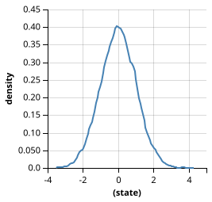

Normal (Gaussian) Distribution
==============================

The normal distribution, often referred to as the "bell curve" due to its shape, is arguably the most important continuous probability distribution in statistics and machine learning. 

What is it and why is it useful?
--------------------------------

In nature and data science, when you add up many independent random factors, their sum tends to look like a normal distribution, regardless of the original distribution of the factors. This phenomenon is called the **Central Limit Theorem**.

Because of this, the normal distribution is perfectly suited for modeling:
* **Measurement errors:** The noise in sensor readings (like a GPS or a thermometer).
* **Biological traits:** Human heights, blood pressure, or test scores in a large population.
* **Uncertainty in Bayesian Inference:** It is heavily used as both a prior (what we believe before seeing data) and a likelihood (how noisy the data is).

Theory and Mathematical Definition
----------------------------------

The normal distribution is completely defined by two parameters:

* **Mean** (:math:`\mu`): The expected value or center of the distribution. It dictates where the peak of the bell curve is located.
* **Standard Deviation** (:math:`\sigma`): The spread of the distribution. A larger standard deviation means the data is more spread out and uncertain.

The Probability Density Function (PDF) is given by the following equation:

.. math::
   
   f(x) = \frac{1}{\sigma\sqrt{2\pi}} \exp\left( -\frac{1}{2}\left(\frac{x-\mu}{\sigma}\right)^{2} \,\right)

Visualizing the Distribution
----------------------------

Here is how a standard normal distribution (:math:`\mu=0`, :math:`\sigma=1`) looks when sampled 10,000 times:

.. code-block:: javascript

   var d = Gaussian({mu: 0, sigma: 1});
   var samples = repeat(10000, function() { return sample(d); });
   viz.hist(samples, {title: "Standard Normal Distribution (mu=0, sigma=1)"});

*(Note: You can easily generate this visualization on webppl.org using the ``viz.hist()`` function.)*

Executable example: Basic properties and sampling
-------------------------------------------------

In WebPPL, you can define a normal distribution using the ``Gaussian`` object. Here we sample from it and calculate its probability density.

.. literalinclude:: ../../examples/distributions/normal_basic.wppl
   :language: javascript
   :linenos:

**Output:**

.. program-output:: python ../scripts/run_webppl.py examples/distributions/normal_basic.wppl --random-seed 0

Executable example: Bayesian Inference with Gaussian
----------------------------------------------------

In this example, we estimate the true length of an object based on several noisy measurements. We use the Gaussian distribution twice: first as a prior for the unknown length, and second as the likelihood to model the measurement noise.

.. literalinclude:: ../../examples/distributions/normal_inference.wppl
   :language: javascript
   :linenos:

**Output:**

.. program-output:: python ../scripts/run_webppl.py examples/distributions/normal_inference.wppl --random-seed 0